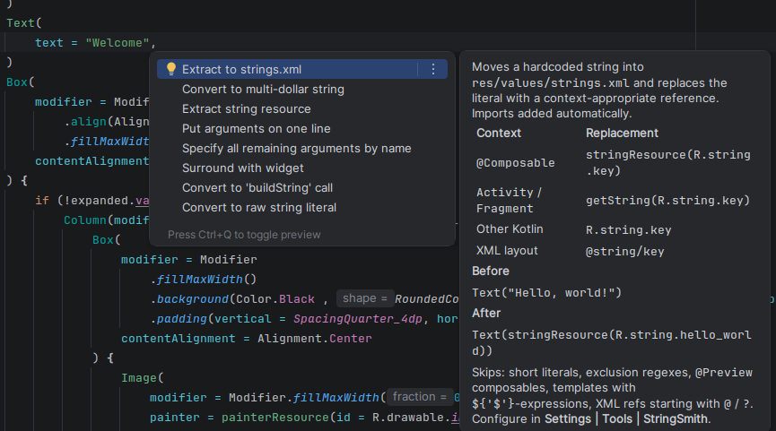
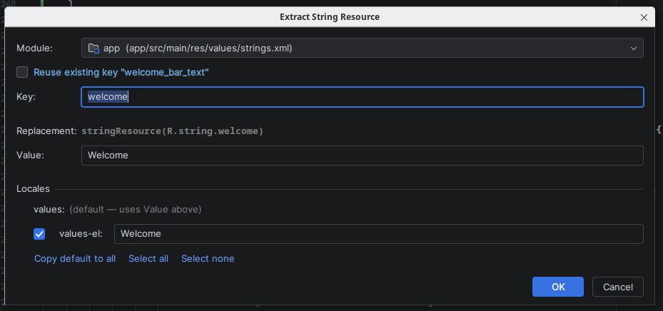
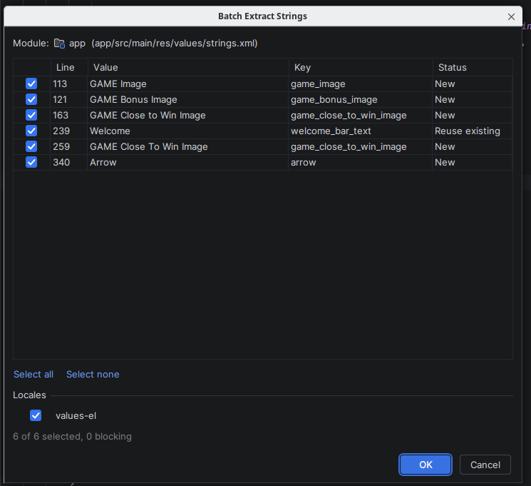
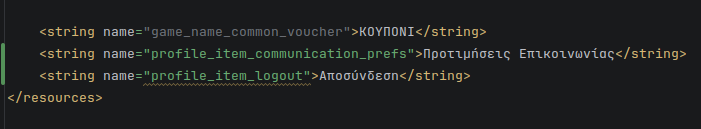
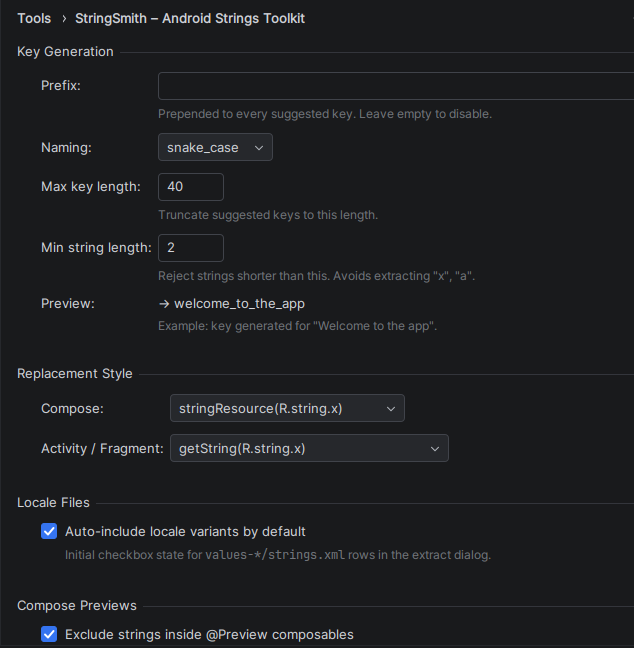
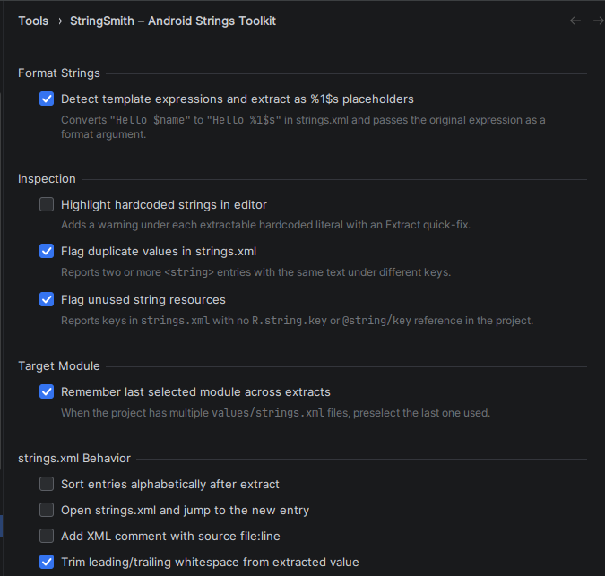

# StringSmith - Android Strings Toolkit

> Stop hand-editing `strings.xml`. Extract hardcoded literals, kill duplicates, and find dead resources — all from the editor.

[](https://github.com/SeijinD/stringsmith/actions)
[](LICENSE)
[](https://plugins.jetbrains.com/plugin/32198-stringsmith--android-strings-toolkit)
[](https://plugins.jetbrains.com/plugin/32198-stringsmith--android-strings-toolkit)
[](https://plugins.jetbrains.com/plugin/32198-stringsmith--android-strings-toolkit)

IntelliJ IDEA / Android Studio plugin for managing Android `strings.xml` resources: extract hardcoded literals with context-aware replacement, detect duplicate values, and flag unused entries — without leaving the editor.

## Contents

- [Features](#features)
- [Screenshots](#screenshots)
- [Install](#install)
- [Usage](#usage)
- [Shortcuts](#shortcuts)
- [Compatibility](#compatibility)
- [Development](#development)
- [License](#license)

## Features

### Extract

- Context-aware replacement
  - Inside `@Composable` → `stringResource(R.string.key)`
  - Inside composable entry-point lambdas (`setContent`, `composable`, `navigation`, `dialog`, `bottomSheet`, `composed`) and nested layout lambdas → `stringResource(R.string.key)`
  - Inside `Activity` / `Fragment` / `View` → `getString(R.string.key)`
  - Other Kotlin code → `R.string.key`
  - XML layout attribute → `@string/key`
- **Kotlin Multiplatform / Compose Multiplatform** — targets under `composeResources/values/` produce CMP references with auto-imported generated `Res`:
  - `@Composable` → `stringResource(Res.string.key)`
  - Other Kotlin code → `Res.string.key`
  - `Res` package auto-detected (gradle `packageOfResClass` → existing imports → derived), with a manual override in settings
- Auto-import for Compose `stringResource` (sorted with existing imports)
- Duplicate value detection during extract — reuse existing key
- Multi-locale propagation across `values-*` folders
- Kotlin template expressions extracted as `%1$s` format args (e.g. `"Hello $name"` → `stringResource(R.string.hello_s, name)`)
- Quick-fix intention on hardcoded literals (Alt+Enter)
- Quick extract: skip dialog when target is unambiguous (inline hint confirms the chosen key)
- Batch extract: extract all strings in a file in one pass — colour-coded per-row status, with status/summary updating live while you edit keys
- `@Preview` composables excluded by default (configurable)
- Key suggestions romanize Greek and Cyrillic and strip Latin accents (`Καλημέρα` → `kalimera`, `Café` → `cafe`)

### Duplicate

- Copy an existing string resource to a new key across `res/values/strings.xml` and every `values-*` locale in one undoable step (`Ctrl+Alt+D` or Alt+Enter)
- Works on any reference: `R.string.key`, `Res.string.key`, `@string/key`, or a `<string>` entry
- Reuses each locale's existing translation; locales that don't translate the source key are skipped (shown in the dialog) instead of being filled with the default value
- Optionally redirects the reference under the caret to the new key (Compose Multiplatform imports updated automatically)

### Inspect

- Hardcoded string highlight in editor (opt-in) — Android resource XML (`res/<type>/`) and Kotlin only
- Duplicate value in `strings.xml` (same text, different keys)
- Unused string resource (no `R.string.key`, `Res.string.key`, or `@string/key` references)

### Settings

Configurable prefix, naming convention, replacement style per context, locale propagation defaults, format-arg detection, inspection toggles, exclusion patterns, and custom composable wrapper names. A live key preview reflects your settings as you type a sample string. Compose Multiplatform projects can set a generated `Res` package override under **Kotlin Multiplatform**.

Custom wrappers: if your project wraps content in a helper whose trailing lambda is a `@Composable` scope (e.g. `screenViewComposable { … }`), add its name under **Settings → Tools → StringSmith → Custom Composable Wrappers** so strings inside it use `stringResource`.

## Screenshots

### Quick-fix (Alt+Enter)

`Extract to strings.xml` right on the hardcoded literal, with a context-aware replacement table and a Before/After preview.



### Extract dialog

Pick key, target module, and per-locale values — with live duplicate-key reuse and a context-aware replacement preview.



### Batch extract

Extract every string in a file in one pass — per-row keys, inclusion toggles, colour-coded status (`New` / `Reuse existing` / `Duplicate` / `Collision` / `Invalid`) that updates live as you edit keys, shared locale propagation, single undoable write.



### Inspections

Duplicate and unused `strings.xml` entries are flagged inline.



### Settings

Configure key generation, replacement style, locale defaults, format-arg detection, inspections, and `strings.xml` behavior.




## Install

### From JetBrains Marketplace

[](https://plugins.jetbrains.com/plugin/32198-stringsmith--android-strings-toolkit)

Or: **Settings → Plugins → Marketplace**, search **StringSmith**, install.

### From source

```
git clone https://github.com/SeijinD/stringsmith.git
cd stringsmith
./gradlew buildPlugin
```

Output: `build/distributions/stringsmith-<version>.zip`

Install via **Settings → Plugins → ⚙ → Install Plugin from Disk**.

### Run sandbox

```
./gradlew runIde              # default IntelliJ Platform sandbox
./gradlew runAndroidStudio    # Android Studio sandbox
```

Android Studio path is auto-detected per OS. Override via the `androidStudioPath`
Gradle property (e.g. in `~/.gradle/gradle.properties`) if installed elsewhere
(such as a JetBrains Toolbox location).

## Usage

### Single extract (with dialog)

1. Place caret inside a hardcoded string literal or XML attribute value.
2. `Ctrl+Alt+X` or right-click → **Extract to strings.xml**.
3. Pick key, module, locale rows in the dialog.
4. Entry written to `res/values/strings.xml`; literal replaced with context-appropriate reference.

### Quick extract (no dialog)

`Ctrl+Alt+Shift+X` — extracts immediately when the target is unambiguous (single module, no key collision, no locale variants, no existing key for the value). Falls back to the regular dialog otherwise.

### Batch extract (whole file)

`Ctrl+Alt+Shift+B` or **Refactor → Batch Extract Strings in File** — opens a table of all extractable strings in the current file. Edit per-row keys, toggle inclusion, pick locale propagation, write all in one undoable step.

### Duplicate a string resource

1. Place caret on a string reference (`R.string.key`, `Res.string.key`, `@string/key`) or a `<string>` entry in `strings.xml`.
2. `Ctrl+Alt+D` or right-click → **Duplicate String Resource** (also Alt+Enter).
3. Pick the new key. The dialog lists which locales receive the copy. Optionally redirect the reference under the caret to the new key.

### `@Preview` exclusion

Strings inside `@Preview` composables are skipped by default (typically dummy data). Toggle in **Settings → Tools → StringSmith → Compose Previews**.

## Shortcuts

| Action | Shortcut |
|---|---|
| Extract to strings.xml | `Ctrl+Alt+X` |
| Quick Extract (skip dialog when unambiguous) | `Ctrl+Alt+Shift+X` |
| Batch Extract Strings in File | `Ctrl+Alt+Shift+B` |
| Duplicate String Resource | `Ctrl+Alt+D` |

## Compatibility

- IntelliJ IDEA 2025.1+
- Android Studio (compatible IntelliJ 251+ platform)
- Kotlin plugin K1 and K2 modes
- Android `res/values/` and Compose Multiplatform `composeResources/values/` resource layouts

## Development

```
./gradlew runIde            # launch sandbox IDE
./gradlew verifyPlugin      # plugin verifier against recommended IDEs
./gradlew buildPlugin       # produce distributable zip
./gradlew test              # run the test suite
```

## License

Apache License 2.0 — see [LICENSE](LICENSE).
